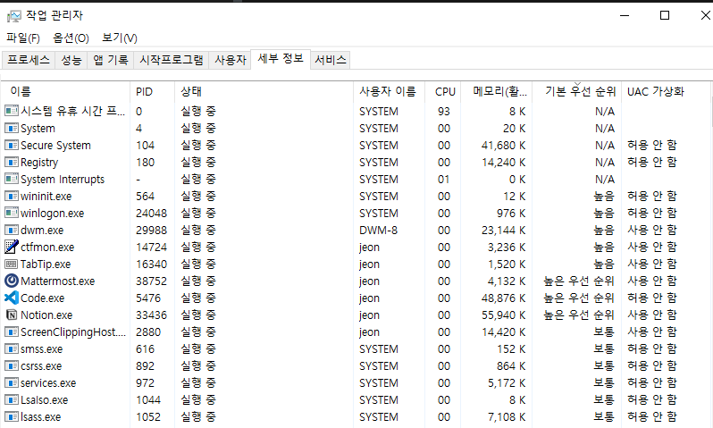

# 11-1. CPU 스케줄링 개요

## CPU 스케줄링?

→ 운영체제가 프로세스들에게 공정하고 합리적으로 CPU 자원을 배분 하는 것.

- 컴퓨터 성능과 직결됨.

## 프로세스 우선순위?

- **모든 프로세스가 CPU를 차례대로 번갈아 가며 사용하는 것**보다는,
**우선순위가 높은 프로세스부터 상황에 맞게 배분하는 것**이 더 효율적이다.

    → 우선순위가 높은 프로세스란, 빨리 처리해야 하는 프로세스를 뜻함.
    - 예시 : 입출력 작업이 많은 프로세스
- 운영체제는 상황과 프로세스의 중요도에 따라 프로세스에 우선순위를 부여
    - 이는 PCB에 기록됨.
    - 우선순위가 높은 프로세스가 더 빨리, 더 자주 실행됨.
- 윈도우의 작업관리자에서 이러한 프로세스 우선순위를 확인할 수 있다.
    
    

### 입출력 집중 프로세스

- 비디오 재생, 디스크 백업 등 입출력 작업이 많은 프로세스
- 프로세스 **실행 상태**보다는 **입출력을 위한 대기 상태**에 더 많이 머무른다.
    - **따라서, 먼저 실행시켜버리고 대기상태에 머무르게 하는 것이 CPU 입장에서는 더 이득이다 !**

### CPU 집중 프로세스

- 복잡한 수학 연산, 컴파일, 그래픽 작업 등 CPU 작업이 많은 프로세스
- 프로세스 **대기 상태**보다는 **실행 상태**에 더 많이 머무른다.