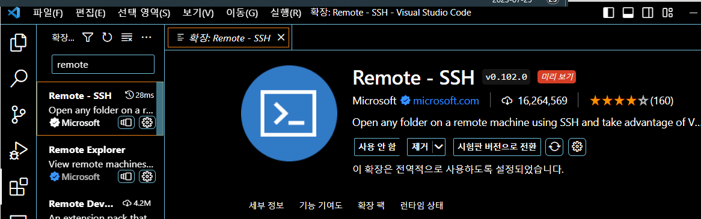

# [07/25] VSCode에서 서버 원격 접속하기 (Windows)

# 1. VSCode 확장(Extenstion) 설치



# 2. 전달받은 서버 키 파일(.pem)을 다음 경로에 위치 시키기

- `**C:\Users\사용자명\.ssh**`
- **서버 키 파일이 없다면 생략.**


# 3. ssh config 수정

## VSCode를 열고 차례대로 수행

### 1) F1 → remote host 검색 → SSH 구성 파일 열기


### 2) C:\Users\사용자명\.ssh\config 선택


### 3) config를 다음과 같이 입력/저장 후 탭 닫기

- 단, 비밀번호가 있다면 `**PasswordAuthentication yes**`를 추가해야 함.

```php
Host [호스트 주소]
  HostName [호스트명(위와 동일하게 입력)]
  IdentityFile "C:\Users\SSAFY\.ssh\[키파일].pem"
  User [리눅스(ubuntu) 유저명]

// 예시
Host 123.123.123.123
	HostName 123.123.123.123
	IdentityFile "C:\Users\SSAFY\.ssh\project123.pem"
	User ubuntu
	PasswordAuthentication yes // 비밀번호가 있다면 추가
```


# 4. 접속하기

### 1) F1 → Connect to Host…  → [아까 만든 호스트명]


### 2) 새로운 창과 함께 OS를 선택하는 창이 뜨면 Linux 선택


### 2-1) 서버 접속 비밀번호가 있다면, 비밀번호를 입력.

### 3) 연결 완료


### 4) 폴더 열기(ctrl + k, ctrl + o) 누르면 다음과 같이 원격의 폴더 경로로 바로 접속 가능

